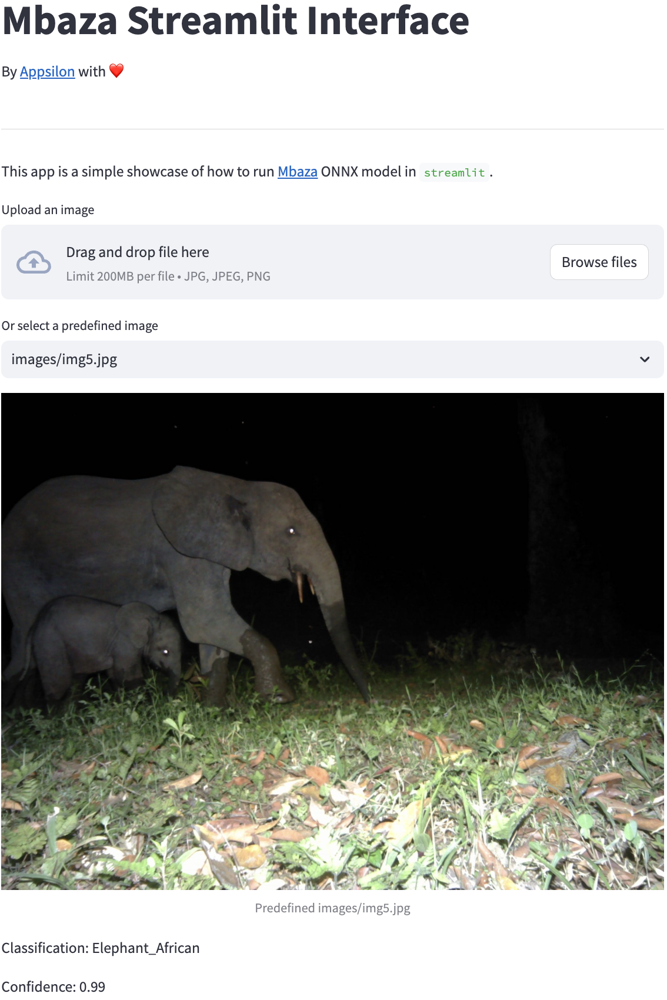

# Mbaza Streamlit Interface

## Overview

This is a `streamlit` web application for showcasing the [Mbaza](https://appsilon.com/data-for-good/mbaza-ai/) ONNX model for image classification. Developed by [Appsilon](https://appsilon.com/).
Note that this is NOT a `streamlit` version of the [Mbaza](https://github.com/Appsilon/mbaza) application.

This application showcases how easy it is to create PoC in streamlit and accompanies XXX post.



## Features

- Upload your own image for classification
- Select from a predefined set of images
- View classification label and confidence score

## Requirements

- Python 3.10
- Libraries listed in `requirements.txt`

## Setup

1. Clone this repository.
2. Download the `gabon.onnx` file from [the Mbaza release on GitHub](https://github.com/Appsilon/mbaza/releases/tag/v2.1.1). Put this file into the `mbaza-streamlit` directory.
3. Create a conda environment.
4. Activate the conda environment.
5. Install the requirements.
6. Run the streamlit app.

```bash
git clone https://github.com/Appsilon/mbaza-streamlit.git
conda create -n mbaza-streamlit python=3.10
conda activate mbaza-streamlit
pip install -r requirements.txt
streamlit run app.py
```

## Live Demo

A live demo of the application is available [on Appsilon's Posit Connect](https://connect.appsilon.com/content/96848cf2-c300-4c67-ac0a-a1833f6f5995).
